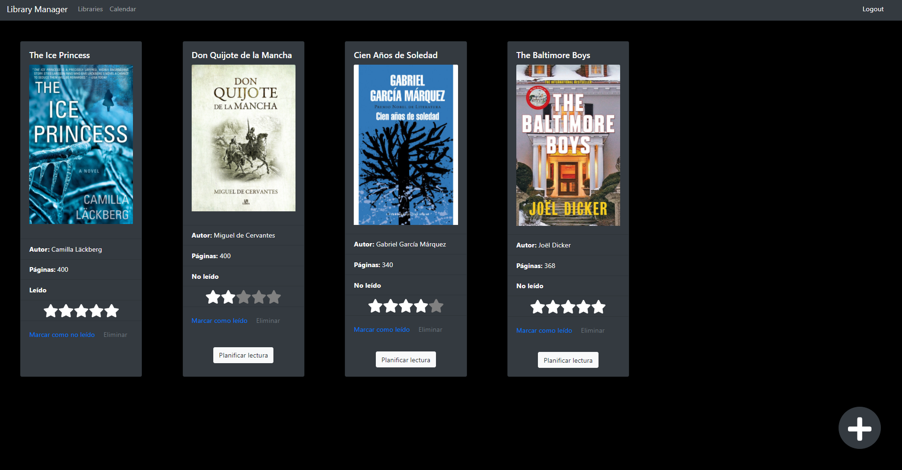

# LibraryManager
This is a projects that its aim consist of managing a library system

## Introduction
This project has been created with Angular, Node, Express, and MySQL. It has an API with token authentication linked to MySQL. Library Manager has a full implementation of Docker to get its functionality with a single command.

### Books view

### Login view

### Register view

### Libraries view

### To read reminders

